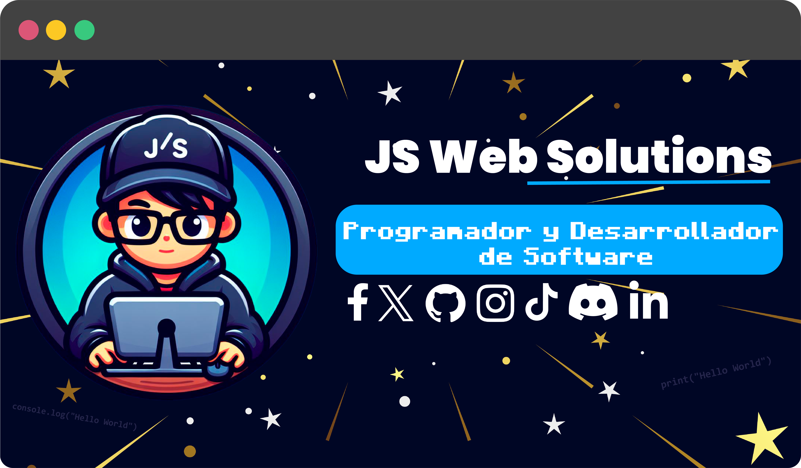

# Hola, un placer, mi nombre es Jesús Suárez👋

##   Programador y Desarrollador de Software

Soy estudiante de Ingeniería en Sistemas.
Actualmente me encuentro en formación para aprender nuevas tecnologías en el área de Programación. Desde 2022 comienza aprendiendo lo básico de HTML5 y CSS3, mientras que en la universidad aprende a C++. Además, inició en el backend en 2023 con PHP y MySQL, y reforzaba mis conocimientos realizando proyectos. Después de indagar en diferentes ramas de la programación me gusta el desarrollo de aplicaciones móviles y Desarrollo Web Fronted.

* 🌍 Venezuela
* 🧠 Estoy aprendiendo Inglés.
* 🤝 Estoy abierto a colaborar en Proyectos que me permitan obtener nuevos conocimientos y habilidades.

## Tecnologías que Manejo.
           

## Diseño Gráfico
 

## Mis Redes Sociales
     

## Contacto
 
<!-- -->

## Estadísticas

